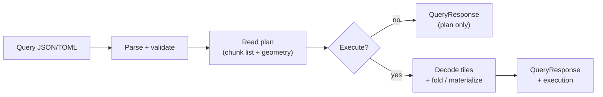

# Query engine

The **query engine** turns a flat JSON or TOML **query document** into a **`QueryResponse`**: catalog resolution, a chunk-level **read plan**, and optionally mmap-backed decode plus **aggregates** or **transformed output**.

You can run queries through:

- **`tet query`** — CLI with plan-only or execute modes ([CLI reference](/cli/query))
- **Rust crate** — `execute_query_json`, `plan_query_with_tet_mmap`, embedder materialize helpers ([Rust quick start](/rust/quick-start))
- **Python (planned)** — tet-py will wrap the same engine; use the CLI subprocess workaround for now ([Python quick start](/python/quick-start))

## What you can do

| Capability | Example |
|------------|---------|
| **Scalar reductions** | Mean, sum, min, max, count, var, std over a selection |
| **Partial-axis reductions** | `"mean": 0` or `"sum": [0, 1]` — reduce along named or numeric axes |
| **Selections & previews** | Half-open slices, strided steps, coordinate label bounds |
| **QC counts** | `nan_count`, `null_count`, `inf_count`, `any_inf`, `any_nan`, `all_finite` |
| **Tier-C stats** | `median`, `quantile`, `histogram`, `covariance`, `correlation` |
| **Transforms** | `zscore`, `minmax`, `softmax`, … with RAM, spill, or sidecar output |
| **Export spill** | Write the full logical selection to a binary file (`"spill": "out.bin"`) |
| **Named axes** | `"mean": "time"` when footer `dim_names` is set |
| **Label slices** | `start_label` / `stop_label` when footer `coords` exist |

The engine reads **one dataset per query** from a sealed `.tet` file. It never loads the whole file into RAM unless the selection and operation require it — tier-A/B reductions use **streaming fold** over touched chunks.

## End-to-end flow



1. **Parse** — Flat document; one top-level operation key; unknown fields rejected.
2. **Plan** — Resolve `selection` to a global box; list intersecting chunks from the catalog.
3. **Execute** (optional) — Decode only touched chunks; run the operation, transform, or spill export.

**CLI mapping:**

| Flag | Effect |
|------|--------|
| `-t PATH` | Attach `.tet` for catalog + read plan |
| `-x` / `--execute` | Run decode and operation |
| `--preview N` | Cap preview sample values (default 64 for `full`/`json`) |
| `--format` | `full`, `json`, `stats`, `plan`, `quiet`, `table` |
| `--device` | Optional GPU routing (experimental; needs `-x`) |

Plan-only (no `-x`):

```bash
tet query mean.toml -t data.tet --format plan
tet query mean.json -t data.tet --format plan
```

Execute with one-line output:

```bash
tet query mean.toml -t data.tet -x -q
# dataset=temperature status=ok op=mean mean=3.5
```

## Query document shape

Documents are **flat** — use `"mean": []` / `mean = []`, not nested `"operation": { "type": "mean" }`. Examples below use tabbed **JSON** / **TOML** blocks.

::: code-group

```json [query.json]
{ "dataset": "temperature", "mean": [] }
```

```toml [query.toml]
dataset = "temperature"
mean = []
```

:::

At most **one** reduction key per document (`mean`, `sum`, `transform`, `spill`, …). See [Query document](/guides/query-engine/document) for the full wire format.

## Implementation tiers

Operations fall into tiers that determine memory use and performance:

| Tier | Pattern | Operations |
|------|---------|------------|
| **A — Scalar fold** | Single pass over all elements; no full tensor in RAM | `sum`, `mean`, `min`, `max`, `count`, `var`, `std`, `product`, `norm_l1`, `norm_l2`, QC counts, `arg_min`, `arg_max`, … |
| **B — Partial-axis fold** | Same streaming path; combine along selected axes | Any tier-A op with non-empty axis list |
| **C — Materialize-required** | Full logical tensor (or temp spill file) | `median`, `quantile`, `histogram`, `covariance`, `correlation` |
| **D — Out of scope** | Separate APIs, not JSON ops | `tet convert`, `tet export`, multi-dataset joins, FFT/ML |

Tier-A/B ops on large selections stay fast: the engine folds per chunk (parallel when in-core, linear scan when out-of-core on contiguous raw payloads). See [Execution strategies](/guides/query-engine/execution).

## What is not supported

These are intentional non-goals for the JSON query surface:

- **Multi-dataset joins** — run two queries or materialize and join in caller code
- **SQL-style filter/group-by** on coordinate values (label **slicing** is supported; filter-by-value is deferred)
- **Spectral / ML ops** (FFT, conv, train) — export a hyperslab, then use NumPy / PyTorch / etc.
- **Arbitrary user callbacks** per chunk
- **Query result cache in `.tet`** — use `tet qhist` for recent query JSON in platform cache only

## Supported dtypes

| Wire tag | Type | Query execution |
|----------|------|-----------------|
| 1 | `f32` | Full support; optional GPU for tier-A/B |
| 2 | `f64` | Full support |
| 3–4 | `i32`, `i64` | Tier-A/B fold; aggregates promote to `f64` |
| 5–7, 9–10 | `u8`, `u16`, `i16`, `u32`, `u64`, `f16` | Tier-A/B fold; `f16` promoted to `f32` on GPU |
| — | `transform` | **`f32` / `f64` only** |

## Further reading

| Page | Topics |
|------|--------|
| [Query document](/guides/query-engine/document) | Fields, TOML equivalents, execution hints |
| [Operations reference](/guides/query-engine/operations) | Every op, response fields, examples |
| [Selections & metadata](/guides/query-engine/selection-and-metadata) | Slices, striding, dim names, coord labels |
| [Execution strategies](/guides/query-engine/execution) | Memory budget, spill, transforms, GPU |
| [Query cookbook](/guides/query-cookbook) | Copy-paste examples |
| [tet query](/cli/query) | CLI flags and output formats |
| [tet qhist](/cli/qhist) | Query history in platform cache |

Upstream implementation detail: [query_engine.md](https://github.com/Latka-Industries/tetration/blob/main/docs/query_engine.md) in the tetration repo.
